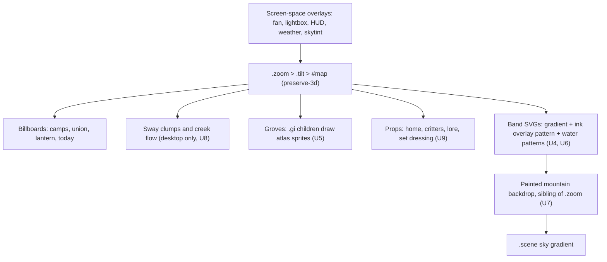
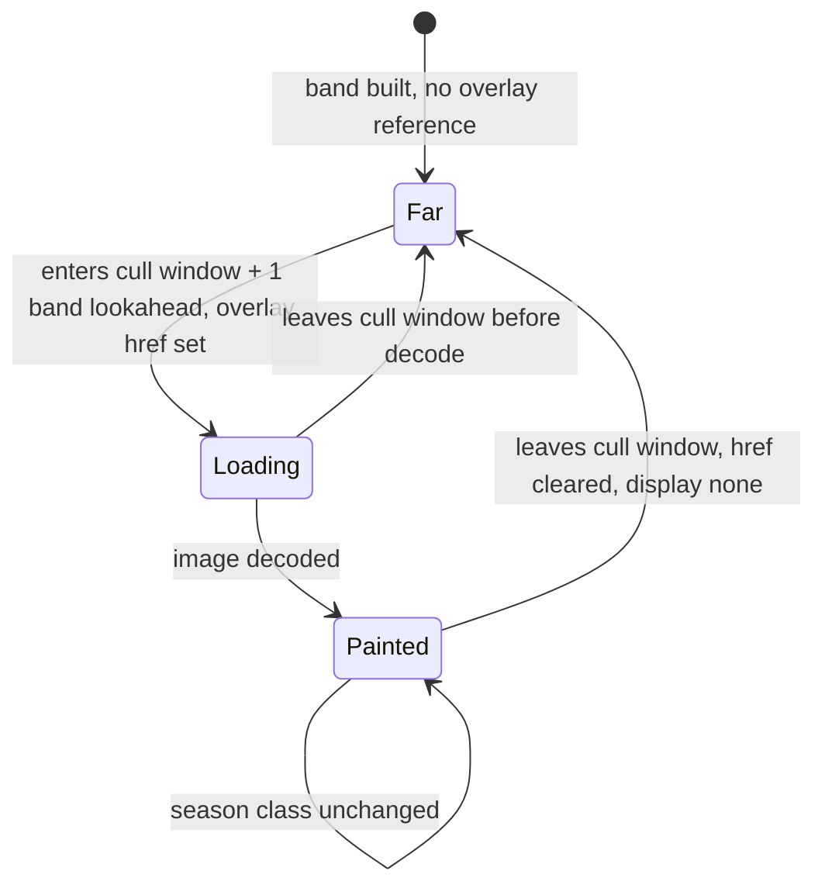

# Illustrated Alpine Ground - Plan

## Goal Capsule

- **Objective:** A family member scrolling the trail on a phone or desktop sees Glacier-country in an ink-and-brush illustrated style. Tall spruce, snow-capped peaks and a glacial-blue creek are the first things the eye reads, the ground slides under the walker with visible depth, and the site stays smooth and never crash-reloads on an iPhone.
- **Means:** Season-neutral brush overlays and sprite atlases enter the existing band and grove systems, and a painted mountain backdrop replaces the ridge (KTD1, KTD2, KTD3). Script placeholders stand in until Claude Design art lands (KTD6).
- **Product authority:** Robert (site owner). Product decisions in Key Decisions were made in dialogue on 2026-09-06 and are not reopened by planning.
- **Execution profile:** Feature branch, then `/deploy-staging`, then Robert's iPhone check, then `/deploy-prod` with his approval. Units U1 to U3 are foundations. U4 must reach staging before U5 to U9 so the iOS 26 memory ceiling is measured with real art in place.
- **Stop conditions:** Stop and report if any single unit makes Robert's iPhone crash-reload on the fling test and no cull or size change inside that unit fixes it. Stop if a settled Key Decision proves infeasible. Do not widen scope into camera push-ins or prop restyling.
- **Not active scope:** camera push-ins and restyling the home, critters, lore items and holiday props. See How This Work Fits Together.
- **Tail ownership:** ce-work verifies locally with the smoke script from U3, then hands off. Staging deploy and the iPhone check are Robert's gate.
- **Open blockers:** none.

---

## Product Contract

### Summary

Rebuild the trail's ground layer as illustrated Glacier-country: brush-textured meadow, scree, snow and creek on the existing tilted plane, painted spruce and boulder sprites, and a painted mountain backdrop that carries the valley walls and peaks. Grass sways and the creek flows on desktop. Phones get the same art with less motion. The plan extends the existing band, grove and overlay systems rather than adding a rendering engine, ships script placeholders now, and hands a written art brief to Claude Design for the final art.

### Problem Frame

The journey world is drawn entirely from flat vector shapes: gradient-filled ground bands, triangle pines, ellipse broadleafs, two-path boulders. At the 60-degree camera every shape reads as a flat cutout, details are sparse, and nothing about it says Alaska or Montana, which is the family's landscape and the site's intended feeling. Robert's reference sites (a scroll-scrubbed photoreal aircraft render, a layered painted mine entrance, and the ink-brush graphic novel The Boat) all get their richness from painted or rendered imagery moving in layers under scroll, not from drawn geometry.

The site already learned hard limits on the way to its current build: every 3D-transformed element is its own GPU surface, iPhone Safari gives 3D content untiled backing stores at 3x and crashed the tab on a single large ground SVG, and CSS filters on the world containers flatten the 3D. Any richer look has to live inside those limits.

### Key Decisions

- **Ground layer first; camera push-ins later.** Push-ins magnify whatever is there, and magnified flat shapes look worse. Governs R21, R22. (session-settled: user-directed — chosen over push-ins first and over one combined plan: the ground is the thing a push-in reveals, so it has to exist before the camera moves toward it.)
- **Ink-and-brush illustration, not photoreal.** Brush texture hides tile seams, sits well with the existing cartoon critters and pet photos, and compresses small for phones. Governs R1, R2, R8. (session-settled: user-directed — chosen over photoreal painted tiles and over procedural noise relief: Robert asked for "simplified like a comic book" after seeing the three approaches, citing The Boat.)
- **Limited palette with ink lines.** Three to four colors per season plus ink linework, so it reads as a print and seasons and night still work by swapping the palette. Governs R3, R14, R15. (session-settled: user-approved — proposed over full-color comic and monochrome ink: monochrome loses the seasons and clashes with per-pet accent colors.)
- **Painted layers on the existing plane plus two valley walls, not a rebuilt six-layer valley.** Real depth for two extra GPU surfaces instead of six. Full valley layering stays a follow-up. Governs R9, R10, R11. (session-settled: user-approved — proposed over a full multi-shelf valley: same peaks-and-depth payoff at a fraction of the phone-memory risk.)
- **Phones get the same art with fewer moving parts.** The art is the point, motion is the garnish. Governs R16, R17, R18. (session-settled: user-approved — chosen over phone-matches-desktop and over desktop-only richness: the family mostly views on phones, and the phone's memory ceiling should cap motion, not texture.)
- **Trees and boulders are repainted with the ground; every other prop keeps its current look.** Spruce are one of the three named anchors, so they belong to this plan. Home, critters, lore items, cupcakes and holiday props are a follow-up. Governs R5, R6, R7.
- **Push-in spots are chosen now and painted richest.** Trailhead home, creek bridge, one dense spruce grove, Belle's lantern, trail's end. Governs R21.
- **Script placeholders now, Claude Design art later, with a written brief.** Every system gets wired and measured on the iPhone without waiting for art; the brief carries the context Design needs. Governs R1, R23. (session-settled: user-directed — chosen over waiting for art before the build and over script art as the final art: the code work must not stall, and generated relief is not the look.)

<!-- ce-section: work-relationships -->
### How This Work Fits Together

This plan owns the ground layer: terrain, trees and rock, water, the mountain backdrop, and the motion on them. The breakdown below is the current understanding, not a committed roadmap.

- Camera push-ins (scroll-choreographed dives into a place, like the mine entrance reference)
  - Depends on this plan: needs painted set pieces to push into.
  - Shares the five push-in spots named in R21.
  - Still to decide: whether scroll pins during a push-in, and how the minimap maps pinned distance.
- Restyling the remaining props to the ink look (home, critters, lore items, cupcakes, holiday props, paw marker)
  - Can proceed independently of this plan once the style sheet from R1 exists.
  - Shares the palette in R3 and the sprite atlas convention from KTD3.
- Full multi-shelf valley (cliff bands, snowfields and peaks as separate depth layers)
  - Depends on this plan landing within the phone budget in R17.
  - Still to decide: whether the painted backdrop already gives enough depth.

### Requirements

**Look and style**

- R1. A written style sheet defines the illustrated look before art is made: brush-grain ink linework over flat washes, simplified shapes, Glacier-country subject matter (subalpine spruce spires, striated grey cliffs with snow patches, alpine meadow, scree, glacial teal water, cumulus sky).
- R2. Every new ground, tree, rock, water and wall asset follows R1 so the world reads as one hand.
- R3. Each season has a palette of three to four colors plus ink black, and every new asset is drawn so a palette swap re-seasons it without redrawing.
- R4. The art's repeat pattern is not visible from the trail at normal zoom on any stretch of the trail. Brush variation and mixed tiles are the intended tools.

**Ground, trees and rock**

- R5. The flat gradient ground is replaced by painted terrain: meadow grass, scree, snowfield, forest floor and a worn dirt trail surface, placed by the same season-and-position logic that colors the ground today.
- R6. Pines and broadleafs are replaced by painted spruce sprites in at least four silhouettes and two heights, with an occasional broadleaf, so a grove reads as varied.
- R7. Boulders and scree are painted rock in the R1 style. Existing ground details (flowers, logs, scree speckle) are either repainted to match or removed. None stay in the old vector style.
- R8. Tree and rock sprites keep the existing grove clustering, depth anchoring and culling behavior, so the count of GPU surfaces does not grow with the new art.

**Valley walls and peaks**

- R9. Two painted valley-wall layers, one per side, rise from the far edges of the ground and carry striated cliffs, snow patches and snow-capped peaks.
- R10. The walls move slower than the ground as the camera walks, so they read as farther away, and they never occlude the trail, camps or photos.
- R11. The existing ridge backdrop is repainted or replaced so it matches the walls in style and does not double the peaks.

**Water**

- R12. The creek and pond are painted glacial teal in the R1 style, with banks and shallows drawn into the ground rather than a stroke laid on top.
- R13. On desktop the creek shows flowing motion (moving highlights or ripples) while it is on screen.

**Seasons and time of day**

- R14. Seasons still change the ground as the camera passes photo dates, using the R3 palettes: spring green, summer deep green, autumn gold, winter snow.
- R15. Day, dusk and night still tint the whole world, including the new walls, with the same look-and-time rules the site has today.

**Motion and the phone rule**

- R16. On desktop, meadow grass near the trail sways gently while on screen. Sway is subtle, never a distraction from the photos.
- R17. On the existing lite tier (coarse pointer or mobile user agent) the same painted art is shown, but grass sway and creek motion are off. A static creek highlight may remain. Scrolling stays smooth and the tab never crash-reloads on Robert's iPhone.
- R18. Users with reduced-motion preference get no grass sway and no creek motion on any device.

**Expandability**

- R19. Trail length still follows the photos in storage. New photos, new seasons and new pets appear on painted ground with no code or art changes.
- R20. New art is loaded only for the stretch near the camera, so a trail that doubles in length does not double what a phone holds in memory.

**Push-in spots**

- R21. Five places get the richest painting and a small amount of extra set dressing: the trailhead home, the creek bridge, one dense spruce grove, Belle's lantern, and the trail's end.
- R22. Nothing in this plan moves the camera toward those spots. They are painted as places, not choreographed.

**Art supply**

- R23. An art brief for Claude Design lists every asset with its purpose, exact pixel size, palette, ink rules and reference notes, so the real art can be produced without reading code and dropped in by filename.

### Key Flows

- F1. Walking a stretch on desktop
  - **Trigger:** Visitor scrolls forward through a summer stretch.
  - **Steps:** Painted meadow and dirt trail slide under the paw marker. Spruce sprites pass on both sides at grove depth. The mountain backdrop drifts slower behind them with peaks above. Grass near the trail sways. The creek, when it comes into view, shows moving highlights.
  - **Outcome:** The stretch reads as one illustrated valley in Glacier country.
  - **Covers:** R5, R6, R9, R10, R13, R16.
- F2. Walking a stretch on an iPhone
  - **Trigger:** Same stretch, lite tier active.
  - **Steps:** Same painted layers appear. Grass is still. Creek highlight is static. Visitor swipes aggressively up and down the whole trail.
  - **Outcome:** No crash reload, no visible stutter. Art matches desktop.
  - **Covers:** R17, R20.
- F3. Crossing a season boundary
  - **Trigger:** Camera passes from a September camp into a December camp.
  - **Steps:** Ground palette shifts from autumn gold to winter snow across the transition zone, as today. Spruce and walls take the winter palette. Existing snow weather particles continue unchanged.
  - **Outcome:** One coherent winter scene, no unpainted or off-palette element.
  - **Covers:** R3, R14.

### Acceptance Examples

- AE1. **Covers R17.** Given an iPhone on the lite tier, when the visitor flings from the intro to the trail's end and back three times, then the page does not reload and no painted band is missing or blank.
- AE2. **Covers R4, R20.** Given a trail twice today's length, when the camera is anywhere on it, then no repeated art is visible at normal zoom and the number of painted ground bands alive at once is unchanged from a normal-length trail.
- AE3. **Covers R10.** Given a camp signpost or fanned photo at the trail's edge, when a valley wall is behind it, then the wall never draws over the signpost or the photo.
- AE4. **Covers R18.** Given reduced-motion enabled on desktop, when the creek and meadow are on screen, then nothing on the ground animates.
- AE5. **Covers R14, R3.** Given the ground in each of the four seasons, when compared side by side, then each uses only its palette colors plus ink, and spruce and walls change with it.
- AE6. **Covers R21, R22.** Given the visitor reaches Belle's lantern, when they look at the surrounding stretch, then it is visibly richer than an ordinary stretch, and the camera behaves exactly as on any other stretch.

### Success Criteria

- Robert names the three anchors unprompted on the first screen after the intro: spruce, peaks, glacial creek.
- A full-trail scroll sweep on desktop keeps the current bar: no long frames.
- Robert's iPhone survives the AE1 fling test with no crash reload.
- Total new art downloaded on a phone for a normal visit stays under 1.5 MB.
- Desktop and phone screenshots of the same stretch are the same painting, differing only in motion.
- Claude Design can produce the final art from the brief alone. Dropping the files in by name and running the manifest rehash step replaces the placeholders with no code change.

### Scope Boundaries

**Deferred for later**

- Camera push-ins and any scroll pinning.
- Restyling the home, critters, lore items, cupcakes, holiday props and paw marker to the ink look.
- A full multi-shelf valley beyond the painted backdrop.
- Sound changes.
- Photo frame, signpost, fan overlay and lightbox styling.

**Outside this product's identity**

- Photoreal textures or photo composites.
- Beaches, deserts or any non-alpine terrain.

**Deferred to Follow-Up Work**

- Long-lived cache headers for `/static/` in `app.py`. The manifest's content-hash query string (KTD9) covers cache-busting for this work; a global cache policy is a separate change.
- Recomputing tilt-derived constants and the minimap on window resize. Pre-existing gap; the new backdrop inherits it and is no worse than the ridge today.
- Reacting to a mid-session change of the reduced-motion preference. Today the flag is read once at load; the new motion follows the same rule.

### Dependencies / Assumptions

- Placeholder art is produced by a script in this repo from the manifest. Real art comes from Claude Design using the brief in R23 and replaces placeholders by filename. Robert reviews the real art before it ships to production.
- Robert's Hidden Lake photo and the three reference sites are reference only. No image from them is copied into the site.
- The existing lite tier detection, band slicing, grove clustering and camera glide are kept and extended, not replaced.
- Blob storage remains the only content source. Painted art ships with the app under `static/images/alpine/`; nothing new is read from storage.
- The July 2026 GPU limits were measured on an earlier iOS. iOS 26's compositor is documented as tighter, so the surface and pixel budgets below are re-measured on Robert's phone at U4 before the remaining units build on them.

### Outstanding Questions

**Deferred to implementation**

- The exact vertical parallax factor for the backdrop (KTD2), tuned on device. Overlay tiles start at 1024 px square (KTD8); a larger tile is tried only if repeats show on device.
- Whether a band that straddles a winter boundary uses the winter overlay, the neutral overlay, or a mid-band split (KTD1). Default: the overlay of the season at the band's midpoint.
- Whether grove sprites use an `img` element or a background-image from the atlas inside each `.gi` child (KTD3). Default: background-image, because it needs no per-image load events.

### Sources / Research

- World DOM: `templates/journey.html` holds `#scene` with `#ridge` as a sibling of `.zoom`, then `.zoom` > `.tilt` > `#map`. Bands, groves, props and billboards are direct children of `#map` (`static/js/journey.js`, band build near the `BANDH` constant, grove build in the tree-placement section, `prop()` and `bb()` helpers).
- Bands: `BANDH = 1600`, `BAND0 = -500`, each band SVG is `W + 2200` wide with a 2 px overlap over the previous band, filled by one shared-coordinate season gradient; a per-band `.detail` group takes procedural scree, flowers and logs as an innerHTML string; a `.shadows` group takes tree shadows.
- Culling in `update()`: bands hidden outside `camY - 2400 .. camY + 1700`; props and groves outside `yMax > camY - 2400 && yMax < camY + 900`; billboards outside `camY - 1500 .. camY + 800`. The ridge transform is written unguarded every frame; everything else is changed-value guarded.
- Groves: items bucketed by `floor(y / 260)` and side of `CX`; the nearest tree anchors the cluster; children `.gi` are positioned in 2D with `GI_F = cos(TILT) * 0.89`; sorted far-to-near so nearer sprites paint on top. Tree heights today range 100 to 230 px.
- Season and time: `SEASON_GROUND` and `SEASON_PINE` tables; `monthAtY` and `yOfMonth`; `timeMode()` and `applyMode()` toggle `body.t-day/t-dusk/t-night` every 10 minutes; night and dusk tint the world only through the `#skytint` overlay, and the ridge through a CSS filter that is legal only because the ridge is outside the 3D tree.
- Lite tier: `LITE` from coarse pointer or mobile UA, adds `body.lite`, reduces fireflies and weather, turns off cloud shadows and the skytint blend. Reduced motion: `reduced` read once at load, plus one CSS `prefers-reduced-motion` block.
- Motion pattern: CSS `@keyframes` plus a class, parameterized by inline custom properties set from JS (`.cloudshadow`, `.firefly`). The creek's `.shimmer` path exists with no CSS rule on purpose; `static/css/journey.css` carries the note that animating water inside the band SVG repaints the whole ground.
- Static assets: Flask defaults, no cache headers, `url_for('static', ...)`. No image preloading exists for world art; photos use `loading="lazy"` through the `/img` proxy (`THUMB_WIDTHS` in `app.py`).
- Model: `get_model()` in `app.py` caches for 60 s and falls back to a last-good snapshot at `STATE_DIR/model.json`. Local dev needs `az login` and blob access.
- `static/images/decorations/mountain_range.jpg` is unreferenced. The lavender field image is used by the album pages.
- iOS 26 (Safari 26, fall 2025) moved compositing to a WebGPU-backed GPU process with tighter VRAM limits; a dashboard with 50 to 120 full-width transparent PNG layers that ran on iOS 17 crashes on iOS 26. Re-measure budgets on device. https://github.com/home-assistant/frontend/issues/28367 and https://webkit.org/blog/16993/
- A compositing layer's backing store scales with the element's rendered footprint times DPR, not the source image size. Decoded image memory is separate and additive; iOS caps decoded non-JPEG images around 3 to 5 megapixels. https://www.williammalone.com/articles/html5-javascript-ios-maximum-image-size/
- Only `transform`, `opacity`, `filter` and `clip-path` animate on the compositor in WebKit; `background-position` does not. https://motion.dev/magazine/web-animation-performance-tier-list
- `content-visibility` is not a safe culling substitute in Safari (recent support, SVG text bug). Keep JS `display:none` culling. https://developer.mozilla.org/en-US/docs/Web/CSS/Reference/Properties/content-visibility
- WebP with alpha is supported on every current Safari; AVIF alpha only from iOS 16.4. WebP is the baseline. https://avifkit.com/blog/avif-browser-support
- Reference sites: wamosair.com (scroll-scrubbed photoreal render), heartofthemountain.com.au (layered painted push-in), sbs.com.au/theboat (ink-brush layered parallax, the chosen finish). Reference photo: Hidden Lake, Glacier National Park.

---

## Planning Contract

**Product Contract preservation:** changed: Key Decisions and Dependencies/Assumptions — the art-supply decision Robert made on 2026-09-06 (script placeholders, Claude Design brief) was added as a Key Decision and R23; the art drop-in success criterion now names the manifest rehash step; Outstanding Questions that planning resolved were rewritten in place; Sources gained the research findings. No existing R-ID changed meaning.

### Key Technical Decisions

- KTD1. **Palette from the existing gradient, texture from season-neutral ink overlays.** The season gradient that fills each band today stays the color source for R3 and R14. Brush texture and ink linework are semi-transparent overlay tiles with no season color of their own, tiled over the gradient inside the band SVG. Winter is the one exception: a snow overlay set with drifts and bare grass replaces the neutral set where the band's midpoint season is winter. Rationale: four painted seasons would quadruple the art and break the mid-band season fades that exist today. (session-settled: user-approved — proposed over four painted seasonal art sets at the scoping synthesis; Robert confirmed.) Governs R3, R5, R14. Owned by U4.
- KTD2. **Valley walls and ridge become one painted mountain backdrop outside the 3D world, above the ground's horizon.** The backdrop is a left flank, a right flank and a centre range, painted with peaks, striated cliffs and snow patches, living where the ridge lives now: a sibling of `.zoom`, behind the world in stacking order, taller than the viewport slice so it can drift vertically with the camera at a fraction of ground speed and horizontally as the ridge does today. Because it is behind the world in stacking order, it can never draw over the trail, camps or photos, which satisfies the non-occlusion half of R10 by construction. Its height and vertical placement are not derived from the tilt, so the no-sky-gap property is tuned and screenshot-verified across `?view=25` to `?view=78` and at the 0.52 minimum zoom scale. Rationale: in-world 3D wall layers would each be a GPU surface spanning the trail, need band slicing, and could occlude billboards; screen-edge side curtains would occlude billboards, which reach the screen edge on desktop today. (session-settled: user-approved — proposed over in-world 3D slopes at the scoping synthesis; Robert confirmed.) Governs R9, R10, R11, R15. Owned by U7.
- KTD3. **Raster art rides inside existing surfaces; no new 3D-transformed elements for static art.** Ground overlays are SVG pattern fills inside the existing band SVGs. Tree and rock sprites are atlas cells drawn by the existing `.gi` children of `.grove` billboards. Water is pattern-filled paths inside the band SVG. The GPU surface count therefore stays at today's bands plus groves plus props. Sprite height is capped at 230 px, the tallest pine today's generator emits, so the event keep-out radii and grove buckets keep working unchanged. Governs R6, R7, R8, R12. Owned by U4, U5, U6.
- KTD4. **Texture loads one band ahead and unloads on cull; the gradient is always underneath.** A band's overlay image reference is attached when the band enters the cull window plus one band of lookahead, and detached when the band leaves it. This defers when a band rasterizes its overlay; whether it also releases decoded memory is measured on device at U4, since WebKit's decoded-image cache is keyed by URL and the same three or four overlay files are shared by every band. When reduced motion is on, the camera jumps without gliding, so the lookahead widens to the whole visibility window to avoid a visible overlay pop on an already-visible band. A runtime gate (`?ground=flat`) skips overlay attachment entirely and is the rollback if the phone budget is hit. The flat season gradient never leaves, so a band whose overlay has not arrived shows the flat color, never blank. Pattern tiles use world-space units anchored at world origin, so tile phase is continuous across the 2 px band overlap and no seam appears. Governs R19, R20; AE1, AE2. Owned by U4.
- KTD5. **Motion is a few small compositor-only elements, desktop only, gated twice.** Grass sway is at most four clump elements per band, each one small billboard containing several grass sprites, animated with a transform rotation about its base using the site's keyframes-plus-custom-properties pattern. Creek flow is one small flat element per water body, clipped to the water shape, containing a highlight image moved with a transform. Neither is created on the lite tier, and a CSS reduced-motion rule disables both animations. Nothing inside a band SVG ever animates, and `background-position` is never animated. `will-change` appears only on these elements and only while their animation runs. Governs R13, R16, R17, R18; AE4. Owned by U8.
- KTD6. **A manifest drives both the placeholder generator and the Design brief.** `static/images/alpine/manifest.json` lists every asset: file name, pixel size, role, atlas cell layout, and a content hash. A Pillow script generates deterministic ink-style placeholders for every entry. The brief in `docs/alpine-art-brief.md` is written from the same manifest, so the real art matches by file name and size. (session-settled: user-directed — chosen over waiting for art and over script art as final: Robert will hand the designs to Claude Design and needs a context document for it.) Governs R1, R23. Owned by U1, U2.
- KTD7. **Verification runs from a fixture and a browser smoke script.** A `JOURNEY_FIXTURE` environment variable makes `get_model()` serve a saved model JSON without touching storage, so the page runs locally without `az login`. The fixture never writes the model cache or the on-disk snapshot, and the variable is ignored with a logged warning when the App Service instance variables are present, so a leftover setting cannot serve fixture data on the live site. A Playwright script drives the page through a full-trail sweep on desktop, lite and reduced-motion profiles and reports long frames, alive bands, blank bands, console errors and art bytes. Photos 404 in fixture mode and that is accepted; the script measures the world, not the photos. (session-settled: user-approved — adjacent scope surfaced at the scoping synthesis; Robert confirmed.) Owned by U3.
- KTD8. **WebP is the only shipped format.** Lossy WebP with alpha for overlays and sprites, lossless WebP for the palette-critical dirt trail and water tiles if lossy banding shows. No AVIF, no `picture` matrix; painted limited-palette art gains little from higher resolution, so one asset per role at 2x its largest CSS footprint. Ground overlay tiles are 1024 px square. Per-category byte caps live in the manifest and are enforced by the generator's check: ground overlays 120 KB each and 450 KB total, dirt, water and bank tiles 40 KB each, tree-and-rock atlas 350 KB, grass sheet 60 KB, highlight strip 20 KB, backdrop images 120 KB each, and a 150 KB reserve for the U9 set-dressing cells. Governs the 1.5 MB success criterion. Owned by U2.
- KTD9. **Assets are referenced with the manifest's content hash as a query string.** Flask static serving stays as is. `app.py` reads the manifest once at import, like the season tables, and the template injects it so `journey.js` builds each URL with `?v=<hash>`. A missing or corrupt manifest logs an error and injects an empty manifest, and `journey.js` treats an empty manifest as the `?ground=flat` state, so the page still renders. The generator has a rehash mode that rewrites hashes from file contents without regenerating art; that is the one step after a real-art drop-in. `journey.js` keeps two URL builders on purpose: the `/img` proxy for blob photos and the manifest helper for art shipped with the app. Owned by U2, U4.

### High-Level Technical Design

Stacking order after this plan, front to back. The backdrop sits behind the 3D world by construction, so it cannot cover trail content.



Band overlay lifecycle under KTD4. The gradient is present in every state.



Directional sketch of what a band contains after U4 and U6, top to bottom in paint order. This is guidance, not a specification.

```text
band svg (world-space viewBox as today)
  defs: seasons gradient (unchanged), pattern "ink-N" (one of 3 neutral or 1 winter, userSpaceOnUse, anchored at world 0,0)
  rect: gradient fill (unchanged)
  rect: pattern fill "ink-N" (KTD1, href attached per KTD4)
  water group: bank stroke (dirt pattern), water body (teal pattern), ink edge stroke (U6)
  trail fill path: dirt pattern + ink edge stroke (U4)
  detail group: atlas image elements for scree, logs, flowers (U4, replaces vector details)
  shadows group (unchanged)
```

### Assumptions

- The neutral ink overlay reads correctly over all four gradient colors at the limited palette. If autumn or spring needs its own overlay after placeholder review, it is added as a manifest entry, not a code change.

### Implementation Constraints

- Never put CSS `filter` on `.zoom`, `.tilt`, `#map` or anything inside them. Tint through `#skytint` and, for the backdrop, the existing ridge filter rules.
- Never animate anything inside a band SVG, and never animate `background-position`.
- Every new element inside `#map` that carries its own transform is a GPU surface. Count them. The desktop budget for new alive surfaces is 16 (12 sway clumps, 2 flow elements, 2 spare). The lite budget is 0.
- Keep `rnd()`, the seeded generator, for all placement randomness so layouts stay deterministic.
- Follow the file's section-divider comments and the "why" comment convention above non-obvious code.

### Sequencing

U1 → U2 → U3 form the foundation and can be done in one PR. U4 lands next and goes to staging alone so the iPhone budget is measured before more art is added. From U4 on, every unit's smoke run reports the alive-surface count and art bytes, since headroom is unknown until U4 ships. U5 and U6 follow in either order. U7 is independent of U5 and U6 and can be done in parallel. U8 depends on U4 and U6. U9 depends on U5 and U7.

### System-Wide Impact

- **Entry points.** `GET /` builds the Jinja context in `journey()` in `app.py` and is where the manifest is injected (KTD9). `GET /api/journey` and `allowed_img_paths()` both call `get_model()`, so the fixture branch (KTD7) lives inside that one function and must not touch `_model_cache` or the snapshot.
- **Image load failure.** Ground bands can never blank (KTD4). The backdrop images hide themselves on load error so the sky gradient shows. Grove sprites preload the atlas once; on failure each `.gi` shows a flat ink silhouette from CSS so trees do not vanish.
- **Manifest failure.** Missing or corrupt manifest degrades to the flat-ground state (KTD9), mirroring the "stale beats broken" posture of `get_model()`.
- **Fixture leakage.** `JOURNEY_FIXTURE` is ignored on App Service (KTD7).
- **Caching.** Flask static files have heuristic browser caching only, so the manifest hash query string is load-bearing for every art swap, including the real-art drop-in (KTD9 rehash step).
- **Frame loop.** `update()` gains the band lookahead attach and detach and the backdrop vertical transform. Attach events peak near 8 per second during a maximum-speed fling, well inside one per frame, but a first attach can repaint the whole band, so the smoke script checks long tasks at attach moments, not only in steady scrolling.
- **Smoke hook.** `window.__journeyStats` is filled inside `update()` and is wired in U3 so the pre-art baseline is measured with the same hook.

### Risks & Dependencies

| Risk | Likelihood | Impact | Mitigation | Owner |
|---|---|---|---|---|
| Each band's untiled backing store on an iPhone is already about 250 MB at DPR 3 (4400 by 1600 world px times zoom times DPR); three alive bands may already be marginal under iOS 26 before any new art | Medium | Crash reload | Re-measure at U4 before U5 onward. If it fails, reduce `BANDH` or the cull and lookahead windows first; overlay tile size and the zoom floor do not shrink the backing store | U4 |
| Band physical width near 13,000 px may exceed the GPU texture width on older A-series chips | Low | Clipped or garbled band | At U4, distinguish a reload from a clipped band on the phone; if clipped, band width is the lever | U4 |
| First overlay attach repaints the whole band and drops a frame | Medium | Visible hitch | Lookahead of one band; smoke asserts no long task at attach moments | U4 |
| Reduced motion jumps the camera past the lookahead and pops an overlay on a visible band | Medium | Visible pop | Lookahead widens to the full window under reduced motion (KTD4) | U4 |
| No kill switch if U4 fails on staging | Low | Delay | `?ground=flat` runtime gate keeps the gradient-only state (KTD4) | U4 |
| One oversized asset hides inside the 1.5 MB total | Medium | Slow phone loads | Per-category caps enforced by the generator check (KTD8) | U1, U2 |
| Long-task bar drifts if it is only relative to a baseline | Medium | Slow regression | Absolute ceilings in the Verification Contract in addition to the baseline | U3 |
| A future edit moves the backdrop inside the 3D world and reintroduces occlusion and the DPR 3 cost | Low | High | A "why" comment at the DOM site; smoke asserts the backdrop adds zero 3D surfaces | U7 |
| Placeholder art is smaller and simpler than the final Claude Design art, so smoke numbers flatter the build | Medium | Surprise at drop-in | Re-run the full smoke and byte check after real art lands, before `/deploy-prod` | Final |
| iOS 26 compositor limits are tighter than the July measurements | Medium | Crash reload | Every unit from U4 reports alive surfaces and bytes; Robert's phone is the gate at U4, U8, U9 and final | All |

---

## Implementation Units

**Phase A: foundations**

### U1. Style sheet, palette and the Claude Design art brief

- **Goal:** Write the style sheet, the four seasonal palettes, and the asset manifest, then derive the Design brief from them.
- **Requirements:** R1, R3, R23; AE5.
- **Dependencies:** none.
- **Files:** `docs/alpine-art-brief.md` (new), `static/images/alpine/manifest.json` (new), `README.md` (one paragraph on the art pack).
- **Approach:**
  1. Write the style sheet section of the brief: brush-grain ink over flat wash, silhouette rules for spruce (narrow spire, drooping tiers, a few bare snags), cliff striations, snow patches, water. Name what is out (photoreal, gradients inside a shape, more than four colors per season).
  2. Write the palettes as hex values, one row per season, mapped to the existing `SEASON_GROUND` colors so the gradient and the sprites share tones. Include the ink color and the teal.
  3. Write the manifest with one entry per asset. Required entries: three neutral ground overlays, one winter overlay, one dirt trail tile, one water tile, one bank tile, one tree-and-rock atlas with cell layout (at least 4 spruce silhouettes at 2 heights, 2 broadleafs, 3 snow-capped spruce, 4 boulders, scree and log and flower cells), one grass clump sheet, one water highlight strip, backdrop left flank, right flank and centre range, and five set-dressing cells for the push-in spots. Each entry has file name, pixel size, role, where it appears, and its byte cap per KTD8. Ground overlays are 1024 px square. The manifest reserves 150 KB for the five U9 set-dressing cells.
  4. Write the brief body from the manifest: per asset, a plain-language description, size, the palette it must use, and which reference it echoes (Hidden Lake photo, The Boat brushwork). Add a short section on how to deliver: same file names, same sizes, WebP.
- **Patterns to follow:** The README's plain, second-person voice. The existing `SEASON_GROUND` and `SEASON_PINE` tables for tone pairing.
- **Test scenarios:** Test expectation: none -- documentation and data; U2 validates the manifest by consuming it.
- **Verification:** Every asset the later units reference exists in the manifest. Robert reads the brief and confirms Claude Design could work from it without the code.

### U2. Placeholder art generator

- **Goal:** Generate deterministic ink-style placeholder art for every manifest entry so the build never waits on real art.
- **Requirements:** R2, R4, R23; supports the 1.5 MB success criterion.
- **Dependencies:** U1.
- **Files:** `tools/gen_alpine_placeholders.py` (new), `static/images/alpine/*.webp` (generated, committed), `requirements-dev.txt` (new, Pillow is already in `requirements.txt`), `tests/test_placeholders.py` (new).
- **Approach:**
  1. Read the manifest; for each entry draw with Pillow: brush-like strokes from short jittered polylines, stipple grain, ink outlines at the palette's ink color, seeded from the file name so re-runs are byte-identical.
  2. Ground overlays are seamless: draw on a torus (wrap strokes at the edges). Atlas cells get 2 px extrusion padding so sampling never bleeds across cells.
  3. Write WebP per KTD8 and update each manifest entry's content hash.
  4. Provide a `--check` mode that verifies every file exists, matches the manifest size, and fails when any per-category cap from KTD8 or the 1.5 MB total is exceeded, naming the offending files.
  5. Provide a `--rehash` mode that rewrites each manifest hash from the file on disk without regenerating art. This is the one step after real art is dropped in (KTD9).
- **Execution note:** This is tooling. Prefer a runtime check of output sizes and byte totals over unit coverage of drawing code.
- **Patterns to follow:** The `.claude/skills/deploy-staging` script style for a tool with a `--check` flag. The seeded `rnd()` idea from `journey.js`, ported to Python's `random.Random(seed)`.
- **Test scenarios:**
  - Running the generator twice produces identical bytes for every file.
  - `--check` passes on a fresh run and fails with a named file when one asset is deleted.
  - `--check` fails and names the category when one asset is inflated past its cap while the total stays under 1.5 MB.
  - After replacing one file with different bytes, `--rehash` changes only that entry's hash.
  - Every atlas cell's opaque pixels stay inside its cell minus the 2 px padding.
  - Ground overlay tiles wrap: the left edge column equals the right edge column and top equals bottom within a tolerance.
  - Total bytes are under 1.5 MB; the test names the largest three files when it fails.
- **Verification:** Generated files render in a browser, tile without a visible seam when repeated four by four, and the check passes.

### U3. Fixture mode and browser smoke script

- **Goal:** Run the journey locally without storage and measure frames, alive bands, blank bands and console errors automatically.
- **Requirements:** supports AE1, AE2, AE4 and the frame success criterion.
- **Dependencies:** none (can run in parallel with U1, U2).
- **Files:** `app.py` (fixture hook in `get_model()`), `static/js/journey.js` (the `window.__journeyStats` hook inside `update()`), `tests/fixtures/journey-sample.json` (new, a redacted model with three pets, twelve camps, one creek, one pond, a lantern), `tests/smoke/journey-smoke.mjs` (new), `tests/smoke/package.json` (new, Playwright pinned), `README.md` (a Development paragraph).
- **Approach:**
  1. In `get_model()`, when `JOURNEY_FIXTURE` names a readable file, return its JSON and skip storage, the model cache and the snapshot, so a fixture run never overwrites the last-good snapshot. Log once that fixture mode is on. Ignore the variable when it is unset, and ignore it with a warning when the App Service instance variables are present (KTD7).
  2. Add the `window.__journeyStats` hook inside `update()` now, filled with alive band count, alive 3D surfaces inside `#map`, bands missing an attached overlay while visible, and camera position, so the pre-art baseline uses the same hook. The smoke script starts the page with `?t=day`, scrolls the full trail in fixed steps and in three instant teleports, and records long frames through a `PerformanceObserver` for `longtask` plus per-frame timing from a `requestAnimationFrame` sampler.
  3. Run three profiles: desktop; lite (coarse pointer emulation plus an iPhone user agent); desktop with `prefers-reduced-motion: reduce`. Assert per profile: zero console errors, alive bands never above 3, no visible band without its overlay for longer than one second after it entered the window, no animated element present under reduced motion, zero long tasks of 50 ms or more, and frame times within the Verification Contract ceilings. Record the current vector build's numbers as the baseline the ceilings must not regress past.
  4. Report total transferred bytes for `static/images/alpine/` per profile.
- **Execution note:** Establish the baseline numbers on the current vector build first, then keep them as the bar for every later unit.
- **Patterns to follow:** The staging smoke test in `.claude/skills/deploy-staging/SKILL.md` for how the site is currently checked after deploy.
- **Test scenarios:**
  - With `JOURNEY_FIXTURE` set to the sample, `/` renders the journey and `/api/journey` returns the fixture without any storage call.
  - With the variable unset, behavior is unchanged: storage is consulted and the snapshot fallback still works.
  - With the variable pointing at a missing file, the app logs the problem and falls back to the normal path rather than crashing.
  - With the variable set and the App Service instance variables present, the fixture is ignored and a warning is logged.
  - After a fixture run, the on-disk snapshot file is unchanged.
  - The smoke script fails when a band is left visible with no overlay for more than one second (simulate by blocking the overlay URL).
  - The smoke script fails when an element with a running animation exists under the reduced-motion profile.
  - Covers AE2. With a fixture whose trail is twice the sample length, alive bands still never exceed 3.
- **Verification:** The script passes on the current vector build with the baseline recorded in the repo.

**Phase B: ground**

### U4. Ground overlays, trail surface and detail sprites in the band system

- **Goal:** Replace the flat gradient look with brush overlays, a painted dirt trail and sprite-based ground details, with load-ahead and unload-on-cull.
- **Requirements:** R2, R4, R5, R7, R14, R19, R20; AE1, AE2, AE5; F1, F2, F3.
- **Dependencies:** U1, U2, U3.
- **Files:** `app.py` (manifest load at import and injection in `journey()`), `static/js/journey.js` (band build, band-detail build, `update()` cull block, `assetUrl` helper), `static/css/journey.css` (band rules), `templates/journey.html` (manifest injection), `tests/smoke/journey-smoke.mjs` (overlay and attach assertions).
- **Approach:**
  1. Load the manifest once at import in `app.py` with the empty-manifest fallback from KTD9, inject it into the template next to `window.JOURNEY`, and add a small `assetUrl(name)` helper in `journey.js` that appends the hash. Honor `?ground=flat` and an empty manifest by skipping every overlay attach.
  2. In the band build, add per KTD1 a pattern definition per band that references one of the three neutral overlays chosen by `rnd()` and the band index, or the winter overlay when the midpoint season is winter, with `patternUnits` in user space anchored at world origin so phase is continuous across bands. Add the pattern-filled rect above the gradient rect. Do not set the image reference yet.
  3. Give the trail fill path a dirt-tile pattern and an ink edge stroke. Keep the trail geometry unchanged.
  4. Replace the procedural scree, flowers and logs in the band-detail string with `image` elements that reference atlas cells, keeping their positions and the season rules that place them. Remove what has no atlas cell.
  5. In `update()`, extend the band cull block per KTD4: compute a lookahead window one band larger than the visibility window, or the whole visibility window when reduced motion is on; attach the overlay and detail image references when a band enters it and clear them when it leaves; keep `display:none` for the visibility window as today. Guard writes behind changed-value checks like the neighbors.
  6. Extend `window.__journeyStats` with overlay attach timestamps so the smoke script can check long tasks at attach moments.
  7. Deploy this unit alone to staging and run the AE1 fling test on Robert's iPhone. Record the result in the PR before U5 starts.
- **Execution note:** Measure first. Take the smoke baseline from U3, then compare after each step. If the iPhone reloads, reduce `BANDH` or the cull and lookahead windows first, because the band's backing store scales with its footprint, not the tile. Overlay tile size is the last lever. If the phone shows clipped or garbled bands rather than a reload, band width is the lever.
- **Patterns to follow:** The band-build loop and its "why" comments; the guarded cull writes in `update()`; the `SEASON_OF(monthAtY(y))` idiom for season at a position.
- **Test scenarios:**
  - Covers AE2. Two adjacent bands show no visible seam and no phase jump in the overlay at the 2 px overlap, checked by pixel comparison of a strip across the seam in a screenshot.
  - Covers AE1. A band whose overlay URL is blocked still shows the season gradient, never a blank area.
  - A band two positions ahead of the visibility window has its overlay reference attached; a band three positions ahead does not.
  - A band that leaves the window has its overlay reference cleared and is `display:none`.
  - With `?ground=flat`, no overlay is ever attached and the page renders the gradient-only world with zero console errors.
  - Under the reduced-motion profile, an instant jump to the trail's end never shows a visible band without its overlay.
  - No long task of 50 ms or more occurs within 100 ms of any overlay attach during the desktop sweep.
  - Covers AE5. Screenshots at a spring, summer, autumn and winter camp each contain only the palette colors plus ink within a tolerance, and the winter band uses the winter overlay.
  - A trail twice the fixture length still produces at most 3 alive bands and the same number of attached overlays.
  - No vector scree, flower or log path remains in any band's detail group.
  - Long tasks in the desktop sweep do not exceed the U3 baseline.
- **Verification:** Smoke passes in all three profiles; staging deploy; Robert's iPhone passes the fling test; screenshots show brush texture and a painted trail with the season colors intact.

### U5. Spruce and rock sprite atlas in groves

- **Goal:** Replace the procedural pine, broadleaf and boulder SVGs with atlas sprites drawn by the existing grove children.
- **Requirements:** R2, R6, R7, R8, R14; F1.
- **Dependencies:** U4.
- **Files:** `static/js/journey.js` (tree placement and grove build, boulder placement, `SEASON_PINE` use), `static/css/journey.css` (`.grove .gi` rules), `tests/smoke/journey-smoke.mjs` (surface-count assertion).
- **Approach:**
  1. Keep the placement loop, bucket size, nearest-tree anchor, `GI_F` offset and far-to-near sort unchanged (KTD3).
  2. Each grove item records an atlas cell and a height instead of an SVG string. Choose the silhouette with `rnd()`: four spruce silhouettes, two heights, broadleaf at the existing 26 percent, snow-capped spruce cells when the item's season is winter. Cap height at 230 px.
  3. Render each `.gi` as a sized element showing its atlas cell, keeping `translateX(-50%)` and the bottom anchoring. Keep the shadow ellipse logic and shadow radius per item. Preload the atlas once; if it fails to load, a CSS class gives each `.gi` a flat ink silhouette so trees never vanish.
  4. Boulders use rock cells with the same clustering they have today.
  5. Delete `pineSVG`, `broadleafSVG` and `boulderSVG` once nothing references them. Keep `SEASON_PINE` only if the atlas needs a tint class per season; otherwise remove it.
- **Patterns to follow:** The grove build's comments about anchoring and sort order; the existing `.gi` sizing.
- **Test scenarios:**
  - The number of `.grove` elements for the fixture trail is unchanged before and after this unit.
  - No `.gi` renders taller than 230 px.
  - A grove with items at several depths still paints nearer sprites over farther ones.
  - Winter groves show snow-capped cells; summer groves do not.
  - Covers AE3. No grove sprite overlaps a camp signpost or the union gate in a full-trail screenshot pass, using the existing keep-out radii unchanged.
  - Desktop long tasks and alive-surface count stay at the U4 level.
  - With the atlas URL blocked, groves still show ink silhouettes and no console error escapes the fallback.
- **Verification:** Smoke passes; a grove screenshot shows at least four distinct spruce silhouettes; no procedural tree code remains.

### U6. Painted creek and pond

- **Goal:** Paint the creek and pond in the ink style with banks and shallows drawn into the ground.
- **Requirements:** R2, R12; F1.
- **Dependencies:** U4.
- **Files:** `static/js/journey.js` (creek and pond group build, bridge group), `static/css/journey.css`.
- **Approach:**
  1. Keep the creek and pond geometry. Replace the three plain strokes with, in paint order: a wide bank stroke filled by the bank tile pattern, a water body stroke filled by the water tile pattern, and an ink edge stroke. The `.shimmer` dash path is removed; U8 supplies motion outside the band.
  2. Pond: same three layers on the ellipse.
  3. The bridge keeps its geometry and gets an ink outline so it sits in the style until the prop restyle follow-up.
- **Patterns to follow:** The creek group's innerHTML build and its clone-per-band placement.
- **Test scenarios:**
  - The creek is visible in every band it crosses, with continuous banks across the band seam.
  - Water pixels in a screenshot are within the palette teal tolerance.
  - No animated element exists inside any band SVG after this unit.
  - The bridge still sits centred on the trail crossing.
- **Verification:** Smoke passes; screenshots of the creek and pond show painted water with banks.

**Phase C: distance and motion**

### U7. Painted mountain backdrop with valley flanks

- **Goal:** Replace the ridge SVG with a painted backdrop of left flank, right flank and centre range that drifts with the camera and never covers trail content.
- **Requirements:** R2, R9, R10, R11, R15; AE3; F1.
- **Dependencies:** U1, U2. Independent of U4 to U6.
- **Files:** `templates/journey.html` (`#ridge` markup), `static/css/journey.css` (`.ridge` rules), `static/js/journey.js` (the ridge transform write in `update()`), `tests/smoke/journey-smoke.mjs`.
- **Approach:**
  1. Replace the inline ridge SVG with three positioned image elements inside `#ridgeInner`: left flank, centre range, right flank, each sourced from the manifest. The container grows from 30vh to a height that leaves room for vertical drift and stays above the ground's projected far edge.
  2. In `update()`, next to the existing ridge write, translate the backdrop by a fraction of `camY` (start near 0.03, tune on device) and by `camX` as today. Loop the vertical drift within the backdrop's spare height so it never runs out over a long trail (KTD2).
  3. Keep the backdrop behind `.zoom` in DOM order, with a "why" comment at the DOM site naming both reasons: non-occlusion for R10 and staying outside the untiled 3D backing stores. Keep the dusk and night filter rules on `.ridge`, which remain legal because the backdrop is outside the 3D tree (R15). Each backdrop image hides itself on load error so the sky gradient shows.
  4. Remove `static/images/decorations/mountain_range.jpg` if it is still unreferenced.
- **Patterns to follow:** The unguarded ridge transform write; the `.ridge` positioning rules.
- **Test scenarios:**
  - Covers AE3. In a full-trail screenshot pass, no backdrop pixel is painted over any billboard or the trail, verified by the backdrop's bounding box never intersecting a billboard's bounding box.
  - The backdrop moves less than the ground between two scroll positions, measured by transform deltas.
  - Over a trail twice the fixture length, the backdrop's vertical offset stays within its looped range.
  - Night mode dims the backdrop; day mode does not.
  - Only one new compositing layer per backdrop image exists, on desktop and lite, and the smoke report shows zero new 3D surfaces inside `#map` from this unit.
  - With one backdrop image URL blocked, that image is hidden and the sky gradient shows with no console error escaping the fallback.
- **Verification:** Smoke passes; screenshots at the intro, mid-trail and the end show peaks on both sides and centre with no gap at the top of the viewport at any camera angle from `?view=25` to `?view=78`.

### U8. Grass sway and creek flow, desktop only

- **Goal:** Add subtle grass sway near the trail and flowing highlights on the creek, gated off on lite and reduced motion.
- **Requirements:** R13, R16, R17, R18; AE4; F1, F2.
- **Dependencies:** U4, U6.
- **Files:** `static/js/journey.js` (a sway-clump and flow-element builder next to `prop()`; the props cull block), `static/css/journey.css` (`.sway`, `.flow` rules and keyframes; the reduced-motion block), `tests/smoke/journey-smoke.mjs`.
- **Approach:**
  1. Skip this unit's element creation entirely when `LITE` is true (KTD5).
  2. Sway: for each band, place up to four clump elements near the trail using `rnd()` and the event keep-out. Each clump is one billboard-style element containing three to five grass sprites from the grass sheet. The keyframe rotates the clump about its base by a few degrees with `--dur` and `--delay` set per instance. Register clumps in the props list so the existing cull hides them and drops their surfaces.
  3. Flow: one flat element per water body inside `#map`, sized to the water's bounding box, clipped to the water shape, containing the highlight strip moved by a translate keyframe along the creek's main direction. Register it in the props list for culling.
  4. CSS: `will-change: transform` only on `.sway` and `.flow`; the existing reduced-motion block sets their animation to none.
- **Patterns to follow:** `.cloudshadow` and `.firefly` keyframes with inline custom properties; the `LITE` guard on cloud shadows.
- **Test scenarios:**
  - Covers AE4. Under reduced motion no `.sway` or `.flow` element has a running animation.
  - On the lite profile no `.sway` or `.flow` element exists in the DOM.
  - On desktop, alive `.sway` elements never exceed 12 and `.flow` never exceeds 2 during the full sweep.
  - Sway clumps respect the event keep-out: none overlaps a camp signpost.
  - Desktop long tasks stay at the U4 level with motion running.
  - Clumps and flow elements are hidden by the props cull when off camera.
- **Verification:** Smoke passes in all profiles; a desktop recording shows gentle sway and moving water highlights; the lite build shows the same art with nothing moving.

### U9. Set dressing at the five push-in spots

- **Goal:** Make the trailhead home, creek bridge, one dense spruce grove, Belle's lantern and the trail's end visibly richer with extra sprites, without touching the camera.
- **Requirements:** R21, R22; AE6.
- **Dependencies:** U5, U7.
- **Files:** `static/js/journey.js` (a dressing pass after events are placed, using `prop()`), `static/images/alpine/manifest.json` (five set-dressing cells already declared in U1).
- **Approach:**
  1. Resolve the five spots from the model: the home at the trailhead, the creek crossing, the grove bucket with the most items, the lantern event, the trail's end marker.
  2. For each spot, add a small fixed arrangement of atlas sprites through `prop()`: woodpile and fence at the home, planks and mossy rocks at the bridge, a fallen log and denser undergrowth at the grove, a wildflower ring at the lantern, a cairn at the end. Respect the event keep-out for anything that could overlap a billboard.
  3. Raise the tree density in the chosen grove's bucket only, within the surface budget, since it is still one grove element.
- **Patterns to follow:** `prop()` and `addShadow()`; the lore-item placement for how objects sit near an event without covering it.
- **Test scenarios:**
  - Covers AE6. Each of the five spots has at least one dressing prop within its keep-out distance, and no prop overlaps its billboard.
  - The camera glide, spacer height and minimap are byte-identical before and after this unit for the same fixture.
  - Alive surfaces stay within the budget when all five spots are in view one at a time.
  - When the model has no lantern (no pet has passed), the lantern dressing is skipped without error.
- **Verification:** Smoke passes; screenshots at each spot show the dressing; a diff of the camera and spacer values shows no change.

---

## Verification Contract

| Check | Command or action | Applies to | Pass signal |
|---|---|---|---|
| Placeholder art | `python3 tools/gen_alpine_placeholders.py --check` | U2 and any unit that adds a manifest entry | Every file present at manifest size; total under 1.5 MB |
| Placeholder tests | `python3 -m pytest tests/test_placeholders.py` | U2 | All pass |
| Local run | `JOURNEY_FIXTURE=tests/fixtures/journey-sample.json python app.py` | U3 onward | Journey renders at `http://localhost:8000` without storage |
| Browser smoke | `cd tests/smoke && npm install && node journey-smoke.mjs` | U3 onward, all three profiles | Zero console errors; alive bands at most 3; no blank band beyond 1 s; no animation under reduced motion; zero long tasks of 50 ms or more; desktop frames average at most 12 ms and worst 16 ms; lite frames average at most 14 ms and worst 20 ms; reduced motion matches its base profile; no regression past the U3 baseline |
| Surface budget | Smoke report line | U4 onward | New alive 3D surfaces at most 16 on desktop and 0 on lite |
| Staging deploy | `/deploy-staging` | U4 first, then each later unit | Workflow green; staging smoke passes |
| iPhone fling | Robert on the staging URL | U4, U8, U9 and final | Three full flings with no reload (AE1) |
| Art bytes | Smoke report line for `static/images/alpine/` and `--check` | U4 onward | Under 1.5 MB per phone visit and within every per-category cap |
| Production | `/deploy-prod` with `DEPLOY_APPROVED=1` | Final | Robert's approval after the staging review |

---

## Definition of Done

**Global**

- All nine units merged to `staging`, staging smoke green, and Robert's iPhone passes the fling test on the final build.
- The Design brief exists, covers every manifest asset, and Robert has confirmed it is enough for Claude Design.
- Dropping a real WebP over a placeholder with the same name and size, then running the rehash step, changes the site on the next load with no code change.
- The full smoke and byte check pass again after the real art replaces the placeholders, before the production deploy.
- No procedural tree, boulder or vector ground-detail generator remains in `journey.js`. No abandoned experiment code, feature flags or commented-out variants remain in the diff.
- README documents fixture mode, the smoke script and the art pack.
- Production deploy done with Robert's approval.

**Per unit**

- U1: manifest and brief reviewed by Robert.
- U2: generator idempotent, check passes, tests pass.
- U3: smoke passes on the vector build with a recorded baseline.
- U4: smoke passes; staging deployed; iPhone fling passed and recorded.
- U5, U6, U7: smoke passes; screenshots reviewed against the style sheet.
- U8: smoke passes in all three profiles; motion absent on lite and reduced motion.
- U9: smoke passes; five spots screenshot-reviewed; camera values unchanged.
