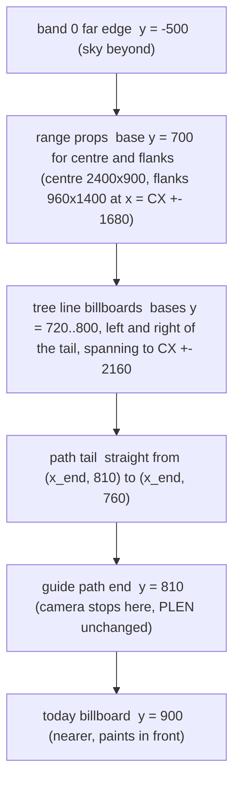
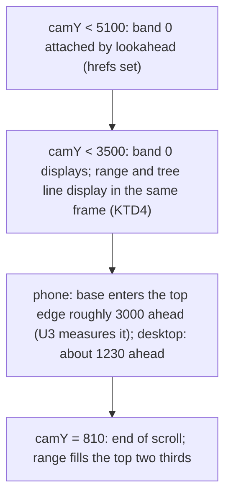

# Trail-End Mountain Range - Plan

## Goal Capsule

- **Objective:** A family member scrolling to the end of the trail, on a phone or a desktop, watches a big painted mountain range rise over the last stretch and fill the top of the frame at the end, with the path walking into a tree line at its foot. The site stays smooth and never crash-reloads on an iPhone.
- **Means:** The three existing backdrop paintings stand on the ground just past the trail's end as upright props inside the world, the way trees and cards do, with spruce sprites and grass at their base and the dirt path extended to meet them. The screen-space backdrop planned as U7 of `docs/plans/2026-09-06-1314-feat-illustrated-alpine-ground-plan.md` is superseded.
- **Product authority:** Robert (site owner). The decisions in Key Decisions were made in dialogue and against an in-engine probe on 2026-09-07 and are not reopened by planning.
- **Execution profile:** One feature branch cut from `feat/alpine-water`, four units in order U1 to U4, one pull request into `staging`. Robert reviews staging on desktop and iPhone before any merge; nothing here merges or deploys.
- **Stop conditions:** Stop and report if the WebKit GPU probe with the range at the trail's end exceeds today's build by more than 15 MB of GPU-process memory, if the smoke cannot pass on every profile without weakening a check other than the surface ceilings named in U3, or if the range cannot be kept in front of the ground on WebKit with the KTD3 nudge.
- **Tail ownership:** The pull request, its review and CI belong to the pipeline; the merge, the staging check and the production deploy stay with Robert.
- **Open blockers:** none.

---

## Product Contract

Product Contract preservation: unchanged. One reading is recorded under Assumptions (A2): R13's "never pops into a visible frame" is met on the phone by appearing in the same frame as the first ground band, which is the far-edge appearance every band has today.

### Summary

Put a painted mountain range at the very end of the trail, standing in the world so perspective makes it grow as the walker approaches. Hide its base with a tree line of existing sprites and run the visible path up to its foot. Ship with the paintings we already have; a redraw later is a file swap.

### Problem Frame

The first U7 tried a screen-space backdrop behind the world. The world has no horizon inside the frame at the shipped camera angle, so showing a backdrop meant lowering the camera, and the lowered camera broke props, photo cards and the smoke geometry. Robert deferred it after the staging review on 2026-09-07.

The trail's end has about 1,300 world px of open ground past the last card, and the sky already shows above that ground at the end of the scroll. That is the one place on the trail where mountains can stand on the ground and be seen without touching the camera.

A throwaway probe in the real engine (`.context/compound-engineering/ce-prototype/2026-09-07-trail-end-range/`) confirmed the shape: upright props past the end render on desktop and phone, cost about 2 MB of GPU-process memory on the iPhone probe, and enter the frame base-first from the top edge as the camera approaches.

### Key Decisions

- **The range is upright props inside the world, at the trail's end only, not a screen-space layer.** The world's far edge is above the frame everywhere except the trail's end, and props need no camera change. (session-settled: user-directed — chosen over the screen-space backdrop behind `.zoom`: that approach needed a lowered default camera, which broke props, cards and tests on staging.) Governs R1, R4, R15.
- **Native painting size, base about 110 world px past the trail's end.** Peaks stay visible on both desktop and phone; "very large" comes from filling the top two thirds of the frame. (session-settled: user-directed — chosen over a 1.6x range and over a phone-only 1.9x range after seeing all three in the probe: the bigger sizes cut off the peaks on desktop or the phone and read as a rock wall.) Governs R3, R5.
- **Ship with the existing three paintings; an art refresh is a later file swap.** No code will depend on the art. (session-settled: user-directed — chosen over a Claude Design round first: a redraw for near viewing can land later without code changes.) Governs R2.
- **Sky shows on both devices.** The phone zooms out, so it sees more of the range than desktop does; the original wish for no sky on the phone would need per-device art. (session-settled: user-approved — proposed with the trade-off shown in the probe; Robert chose the native size knowing this.) Governs R5.
- **The old vector ridge silhouette comes out.** The range is the only mountain backdrop; the ridge would otherwise peek in at the phone's edges. (session-settled: user-approved — called out in the scoping synthesis and confirmed.) Governs R7.
- **The visible path ends at the foot of the range.** The trail reads as walking into the mountains; the scroll still ends at the last card. (session-settled: user-directed — added by Robert at the synthesis.) Governs R8.

### Requirements

**Placement and appearance**

- R1. A painted mountain range stands on the ground just past the trail's end, drawn as upright planes inside the world, and appears nowhere else on the trail.
- R2. The range is built from the three existing backdrop paintings in the alpine manifest (centre range, left flank, right flank), unchanged.
- R3. The range's base sits about 110 world px past the trail's end at the paintings' native world size, so the range fills roughly the top two thirds of the frame at the end of the scroll on desktop and on the phone.
- R4. As the camera approaches, the range enters from the top edge of the frame and grows with perspective, and the ground never paints over it at any distance.
- R5. At the end of the scroll, snow-capped peaks are visible on both desktop and phone, with sky above or between them.
- R6. The last card, the path and the tree line paint in front of the range; the range never covers a card, photo or the trail.
- R7. The vector ridge silhouette at the top of the scene is removed.

**Base treatment**

- R8. The visible dirt path continues past the last card and ends at the foot of the range inside the tree line, while the scroll's end point stays at the last card.
- R9. A tree line of existing spruce sprites, with boulders where they fit, runs along the range's base and is dense enough to hide the paintings' flat bottom edge on desktop and phone.
- R10. Grass clumps from the existing grass sheet sit among the tree line: swaying on desktop like the U8 clumps, static on the phone and under reduced motion.

**Performance and tiers**

- R11. The range shows on every tier that shows painted art and is absent in flat mode, and a URL lever turns it off for rollback, following the site's existing lever convention.
- R12. On the iPhone the range adds no crash risk: WebKit GPU-process memory with the camera at the trail's end stays within the envelope of today's build, and the range uses no masks, pattern fills or element opacity on large shapes.
- R13. Scrolling stays smooth: the range attaches early enough that it never pops into a visible frame, and attaching it causes no long task on desktop or phone.
- R14. Day, dusk and night tint the range with the same rules as the rest of the world.
- R15. The default camera angle, zoom scale and scroll length are unchanged.

### Key Flows

- F1. Walking into the mountains
  - **Trigger:** The walker scrolls into the last stretch of the trail.
  - **Steps:** On the phone the range's foothills appear at the top edge a few screens out; on desktop about one screen out. The range slides down and grows as the walker approaches, the tree line and grass resolve at its base, and the path runs on past the last card to the foot of the range. At the end of the scroll the range fills the top two thirds of the frame with peaks and sky above.
  - **Outcome:** The trail reads as ending in the mountains. Nothing about the camera, the cards or the photo fans changes.
  - **Covered by:** R1, R3, R4, R5, R8, R9, R10.

### Acceptance Examples

- AE1. Desktop at the end
  - **Covers R3, R5, R6.**
  - **Given** a 1440 x 1000 desktop window at the end of the scroll, **then** the range covers roughly the top two thirds of the frame, at least one snow-capped peak and some sky are visible, and the last card and its text are fully readable in front of it.
- AE2. Phone at the end
  - **Covers R3, R5, R9.**
  - **Given** an iPhone-sized window at the end of the scroll, **then** the range covers roughly the top two thirds of the frame with peaks and sky visible, and no straight horizontal edge of a painting is visible along its base.
- AE3. Approach
  - **Covers R4, R13.**
  - **Given** the camera 600 world px before the end, **then** the lower part of the range is visible at the top of the frame with ground below it and no ground painted over it; **given** the camera two screens before the end on desktop, **then** no range is visible and no long task was recorded when it attached.
- AE4. Levers and flat mode
  - **Covers R7, R11.**
  - **Given** `?ground=flat` or the range's own off lever, **then** no range paints and the scene's sky gradient shows at the world's edge; **given** the default painted mode, **then** no ridge silhouette element exists in the page.
- AE5. iPhone memory
  - **Covers R12.**
  - **Given** the WebKit GPU probe at the iPhone 13 descriptor sweeping to the end of the trail, **then** the peak GPU-process figure with the range is within a few MB of the same build without it, and there are no page errors.
- AE6. Path to the foot
  - **Covers R8, R15.**
  - **Given** the end of the scroll, **then** the dirt path is visibly continuous from the last card to the tree line at the range's base, and the scroll height and the camera's end position are unchanged from today's build.
- AE7. A painting fails to load
  - **Covers R2, R6.**
  - **Given** one of the three backdrop images is blocked, **then** that plane hides itself, the other two still show, and no error escapes to the console.

### Scope Boundaries

- No mountains, horizon or backdrop anywhere else on the trail; the range is a trail's-end feature only.
- No motion or parallax on the range itself; perspective from the camera's own movement is the only motion.
- No camera, tilt or zoom change (R15).
- U9 set dressing at the five push-in spots stays its own unit; this work unblocks it but does not include it.
- A redrawn range for near viewing (tree line and grass painted in, transparent sky, tall middle, lower shoulders) is deferred; it lands as a file swap under R2 when it exists.

<!-- ce-section: work-relationships -->
### How This Work Fits Together

This plan owns the trail's-end range. The surrounding units below are the current understanding, not a committed roadmap.

- Supersedes U7 of `docs/plans/2026-09-06-1314-feat-illustrated-alpine-ground-plan.md` (the screen-space backdrop and KTD2 there); that plan's R9 to R11 are satisfied differently by R1 to R7 here.
- Enables U9 of that plan (set dressing at the trail's end push-in spot), which depended on U7.
- Can proceed independently of any art refresh; the refresh only swaps the three painting files.

### Dependencies / Assumptions

- The three backdrop paintings carry their own painted sky. At native size that sky merges with the scene's sky gradient; this holds for the shipped day, dusk and night looks.
- The prop and billboard system already stands planes upright and counter-tilts them; the range reuses it rather than adding a new rendering path.
- The phone sees more of the range than desktop because it zooms out to about half size; sky on the phone is accepted (Key Decisions).
- In the Chromium probe the ground painted over the range at one position until the planes were nudged forward in depth; the same nudge, or an equivalent, must hold on iOS WebKit.
- Static grass clumps on the phone are new; today clumps exist only on desktop. The cost is a handful of small sprites and is assumed to fit the iPhone budget.

### Outstanding Questions

**Deferred to Implementation**

- Flank placement at unusual window widths: the plan fixes the flanks at x = CX -+ 1680 with bases 120 px nearer than the centre; a screenshot sweep across 390, 768, 1024, 1440 and 1920 px widths decides whether a seam or gap shows and adjusts the offsets.

### Sources

- Probe run: `.context/compound-engineering/ce-prototype/2026-09-07-trail-end-range/` (`decisions.md` and `01-range-approach/screens/`), also published at https://claude.ai/code/artifact/7713f15b-e69d-42e0-8d96-57aa0f4bd59a. Variant A at native size, base 110 world px past the end, was chosen there.
- Prior plan: `docs/plans/2026-09-06-1314-feat-illustrated-alpine-ground-plan.md`, U7 and KTD2 (superseded), U9 (unblocked), R9 to R11 and R15.
- Deferred first attempt: branch `feat/alpine-backdrop`, commit 511ae85, with the analysis of why no horizon exists at a usable tilt.
- iOS rules: `docs/solutions/performance-issues/ios-webkit-svg-pattern-mask-gpu-memory-crash.md`; probe `tests/smoke/webkit-gpu-memory.mjs` (sweeps to the trail's end at the iPhone 13 descriptor).
- Engine facts verified 2026-09-07: props and billboards counter-tilt at their base (`static/css/journey.css` `.prop` and `.bb`); prop cull window and camera in `update()` in `static/js/journey.js`; the trail runs toward smaller world y and ends about 90 px past the last card, with the first band covering 1,300 px beyond it; the vector ridge lives in `templates/journey.html`, `static/css/journey.css` and one transform write in `static/js/journey.js`; grass clumps are created only under the desktop motion gate; the three backdrop files are in `static/images/alpine/manifest.json` and on disk.

---

## Planning Contract

### Key Technical Decisions

- KTD1. **The range is three `prop()` billboards carrying plain `` elements at native size, base at world y = trail end - 110, inside `#map`.** The prop system already stands planes upright and counter-tilts them; an `` is the primitive the union and camp billboards use, so no new rendering path. (session-settled: user-directed — chosen over a screen-space backdrop behind `.zoom`: the deferred U7 needed a lowered camera that broke props, cards and tests. Governs R1, R2, R3, R15.)
- KTD2. **The tree line is two grove-style billboards, one each side of the path tail, holding all spruce, boulder and static grass sprites as `.gi` children.** One 3D surface per billboard keeps the alive-surface count within a few of today's; the `.grove` pattern already positions `.gi` children by `left` and `bottom` with `GI_F`. Governs R9, R10.
- KTD3. **Range and tree-line billboards get a `translateZ(40px)` nudge after the counter-tilt.** In Chromium the ground band painted over the range at base y 210 and not at y 700; the nudge fixed the failing position in the probe. It must be confirmed on WebKit before merge (U3). Governs R4, R6.
- KTD4. **The range attaches when the first ground band displays, not earlier.** Bands display while `y0 + BANDH > camY - 2400`, so band 0 shows at camY below 3500; a range prop at y 700 with the ordinary prop window shows at camY below 3100, and a wider window would float it over sky where band 0 is still hidden. Each range prop and tree-line billboard carries a per-prop far window derived from its own base, `(BAND0 + BANDH + 2400) - baseY`, so every plane appears in the same frame as band 0. On desktop that distance is above the frame, so no pop is visible; on the phone it is the far-edge appearance every band has today. U3 measures how far ahead the phone's top edge reaches at the end approach so this is stated from data. Governs R13.
- KTD5. **The paintings are warm before the first frame at the end because their `` elements carry `src` from the build.** Reduced motion, a reload with scroll restoration, and a minimap jump can put the camera at the end on the first frame; a hidden `` still fetches and decodes, so no separate preload entry is needed. Governs R12, R13.
- KTD6. **The tree line uses its own seeded generator, not `rnd()`.** Every existing tree, drift and clump position comes from one seeded sequence; the U8 block sits after every other consumer and is tier-dependent, so any `rnd()` call for the tree line would move shipped scenery or make the tree line differ by tier. A small local LCG seeded with a constant gives the same tree line everywhere. Governs R9, R10.
- KTD7. **The visible path tail is appended to the stroke paths only; `guideProbe`, `PLEN` and `lut` keep the untouched `dStr`.** The camera, scroll height, crossings and paw marks read the guide path, so a tail on the five stroke paths (`bandPath`, `fallbackPath`, `inkEdge`, `dirtPath`, `dotsPath`) changes what is drawn and nothing that is measured. Tree-line placement uses the tail's own coordinates, never `trailXAtY` or `atDist`, which clamp to the guide path. (session-settled: user-directed — the path ends at the range's foot, chosen over stopping 90 px past the last card. Governs R8, R15.)
- KTD8. **`?range=off` follows the `GROUND_*` lever convention, reverts the whole trail's end, and flat mode implies off.** `GROUND_RANGE = params.get('range') !== 'off'`; one gate `!GROUND_FLAT && GROUND_RANGE` wraps the range props, the tree line, its grass and sway clumps, and the path tail, so the lever restores today's trail end exactly (the ridge stays removed either way). The range block is inside the existing `!GROUND_FLAT` gate, so `?ground=flat` never builds any of it. Governs R11.
- KTD9. **The vector ridge is deleted outright: markup, `.ridge` rules, the `ridgeInner` transform write.** Nothing else references it. (session-settled: user-approved — removal chosen over keeping it behind the world: the range is the only mountain backdrop and the ridge would peek in at the phone's edges. Governs R7.)
- KTD10. **A painting that fails to load hides its own `` through an `error` listener that sets `hidden`; `journey.css` gains a `[hidden]{display:none}` rule.** The SVG `<image>` fallbacks clear `href`; a plain `` needs the attribute path. Governs R2, R6.
- KTD11. **Night and dusk need no range-specific code.** `#skytint` multiplies over the whole scene and the old ridge's `filter` rules go with the ridge; the range is inside the 3D tree where `filter` is forbidden. Verified by screenshots in U3. Governs R14.

### High-Level Technical Design

World layout at the trail's end (world y grows toward the walker; smaller y is farther):

Attach and reveal along the approach (camY falling toward 810):

### Assumptions

- A1. The paintings' own painted sky reads acceptably under the dusk and night `#skytint` multiply; U3's screenshot pass is the check, and a poor result is an art follow-up, not a code change.
- A2. R13 on the phone means no appearance distinct from the ground's own far-edge appearance; KTD4 is the reading.
- A3. Two tree-line billboards plus three range props plus up to three desktop sway clumps raise the alive-surface maxima by at most 8 on desktop and 5 on lite and reduced; the smoke ceilings move by the measured amount, not by a guess.
- A4. Static grass sprites inside the tree-line billboards cost no measurable GPU memory on the phone, like the atlas sprites did (+4 MB for 93).
- A5. The tree line stands entirely behind the today billboard (bases at y 800 or less against the card's 900) and in front of every painting base (700), so the card paints over the trees and the trees paint over the paintings by depth alone; no `eventClear` call is made for the tree line.

### Implementation Constraints

- No `<pattern>` fills, `<mask>`, or element `opacity` on any new large shape; the paintings are `` elements, the sprites are the existing nested-svg crops.
- No `filter` on anything inside `.zoom`, `.tilt` or `#map`.
- No new `rnd()` call anywhere before the last existing consumer (KTD6).
- All new props register in `props` so the existing cull hides them; new billboards are `.prop` or `.grove` elements so the smoke's DOM surface cross-check counts them.
- Every commit is made on the feature branch with a branch check first; nothing is committed on `main` or `staging`.

---

## Implementation Units

### U1. Range props, lever, preload and ridge removal

- **Goal:** The three paintings stand at the trail's end as upright props, in front of the ground, preloaded, with a rollback lever, and the old ridge is gone.
- **Requirements:** R1, R2, R3, R4, R5, R6, R7, R11, R12, R13, R14, R15; KTD1, KTD3, KTD4, KTD5, KTD8, KTD9, KTD10, KTD11.
- **Dependencies:** none.
- **Files:** `static/js/journey.js`, `static/css/journey.css`, `templates/journey.html`, `README.md`.
- **Approach:**
  1. Add `GROUND_RANGE` beside the other `GROUND_*` levers, and the manifest lookups for the three backdrop files beside `DIRT_URL`, `SNOW_URL` and `ATLAS_URL` (before the preload block); the range is built only when `!GROUND_FLAT && GROUND_RANGE` and all three files are in the manifest.
  2. Extend `prop()` to keep an optional `far` on its `props` entry, and change the cull line to `pr.yMax > camY - (pr.far || 2400)`; every existing prop is unaffected.
  3. After the U8 motion block, build the three props: centre at `(CX, endY - 110)` with the centre painting at 2400 by 900; left and right flanks at `x = CX -+ 1680` on the same base y as the centre, at 960 by 1400; each `` gets width and height attributes, `alt=""`, and an `error` listener that sets `hidden`. Register each with the class `range` and `far: (BAND0 + BANDH + 2400) - baseY`, which is 2800 for a base at y 700, so every plane appears in band 0's frame (KTD4).
  4. Add the CSS: `.prop.range` transform with the `translateZ(40px)` nudge after the counter-tilt, `.grove.range{transform:rotateX(calc(var(--tilt) * -1)) translateZ(40px)}` for the tree-line billboards, `.prop.range img{display:block}` so the prop has no inline descender gap, and `[hidden]{display:none !important}`.
  5. No separate preload: the `` elements carry `src` from the build and fetch regardless of the cull's `display:none`, so the paintings are warm before any reduced-motion or scroll-restored first frame (KTD5).
  6. Remove the `#ridge` block from the template, the `.ridge` rules and their night and dusk filters from the CSS, and the `ridgeInner` lookup and transform write from `update()`.
  7. Add `?range=off` to the README lever paragraph.
- **Patterns to follow:** `prop()` and the home prop for a billboard carrying markup; the union billboard's `` usage; the `GROUND_WATER` lever and its gate; the preload block; the atlas probe's `error` listener.
- **Test scenarios:**
  - Covers AE1. Desktop 1440 by 1000 at the end of the scroll: the centre painting's bounding box spans roughly the top two thirds of the viewport and sampled pixels inside it are not the ground's green palette.
  - Covers AE2. iPhone-size viewport at the end of the scroll: the centre painting's box spans roughly the top two thirds and the sampled pixels inside it are not ground green.
  - Covers AE3. Camera 600 world px before the end on desktop: the painting's box bottom is inside the viewport and the pixels just above it are not ground green; two screens before the end no range `` bounding box intersects the viewport.
  - Covers AE4. `?range=off` builds no `.range` element (props or tree-line billboards), the stroke paths end at the guide path's end as today, and the page has no `#ridge`; `?ground=flat` builds none either; `?ground=flat&range=off` builds none.
  - Covers AE7. With `**/backdrop-centre-range.webp*` blocked, the centre `` has `hidden` and computed `display:none`, the flanks are displayed, and the only console error is the blocked request itself.
  - Range props and tree-line billboards are hidden by the cull while the camera is more than their far window from their base and displayed whenever band 0 is displayed at the same camera position.
  - Night (`?t=night`) at the end: no element inside `#map` carries a computed `filter`, and `#skytint` is present.
- **Verification:** The default smoke sweep passes on every profile with the new range scenario green; `node webkit-gpu-memory.mjs base "range=off"` shows the base within 15 MB GPU of `range=off`; screenshots at the end on desktop and phone show peaks and sky per AE1 and AE2.

### U2. Tree line, static grass, desktop sway and the path tail

- **Goal:** A dense tree line hides the paintings' base, grass sits among it, and the visible path runs into it.
- **Requirements:** R5, R8, R9, R10, R11, R15; KTD2, KTD6, KTD7, KTD8.
- **Dependencies:** U1.
- **Files:** `static/js/journey.js`, `static/css/journey.css`.
- **Approach:**
  1. Append the tail to a `dVis` string used by the five stroke paths: from the guide path's end point straight to `y = endY - 50`, so the strokes end about 60 px inside the tree line; `guideProbe` keeps `dStr`. The append happens only inside the KTD8 gate.
  2. Build a tiny seeded generator local to the range block (constant seed) and use it for every tree-line pick.
  3. Hoist `clumpMarkup` out of the U8 `if (MOTION)` block into a helper `clumpMarkup(gen, sway)` that reads the grass sheet size directly and takes its random source as an argument; the U8 block calls it with `rnd` and sway on, so its output and the seeded sequence are unchanged. With sway off it returns the clump svg without the `sway-in` wrapper, and each cell svg carries the `sp-img` class so the existing `.grove .gi svg.sp-img{overflow:hidden}` rule clips it (the U8 wrapper's own `.sway-in svg svg` rule no longer applies).
  4. Lay out two tree-line billboards, left and right of the tail's x, each spanning from the tail out to about `CX -+ 2160` so the flanks are covered too: spruce sprites (`spruce-tall-*` and `spruce-short-*`, snow variants only if the last band's season is winter) every 60 to 90 px with heights 150 to 230, a few boulders at the front, and static grass clumps between them. When `GROVE_SPRITES` is false the items use `pineSVG` and `boulderSVG` at the same heights, exactly as the grove assembly loop does. Each billboard is a `.grove`-style element with the `range` class whose children are `.gi.sp` sprites positioned by `left` and `bottom` with `GI_F`, anchored at its nearest tree, registered in `props` with the KTD4 far window derived from its base.
  5. Static grass is gated on the grass sheet being in the manifest with its four cells, independent of `MOTION`; when that gate is false the tree line builds without grass.
  6. On desktop only (the existing `MOTION` gate), add two or three ordinary `.prop.sway` clumps in front of the tree line through the same helper with sway on and the range block's generator, so the grass there sways like the rest.
  7. Keep every tree-line base between `endY - 90` and `endY - 10` so all of it stands behind the today billboard and in front of every painting base (the flanks stand level with the centre per U1).
- **Patterns to follow:** the grove assembly loop for `.gi` children and its vector fallback branch, `spriteBox` and `spriteMarkup`, the U8 `clumpMarkup` body, the season lookup used for winter spruce.
- **Test scenarios:**
  - Covers AE6. At the end of the scroll the dirt stroke is continuous from the last card to the tree line: sampled pixels along the tail's x between y 810 and 770 in world space are dirt-toned, not ground green; the scroll height and the camera's end `camY` equal the values on `feat/alpine-water` for the same fixture.
  - Covers AE2 and R9. At the end on desktop and phone, no row of sampled pixels along the range's base line within the viewport is uninterrupted painting color; sprites cover the base.
  - The tree-line billboards each count as one 3D surface: the DOM surface count equals the stats surface count and the total is within the new ceilings.
  - With `?sprites=off` the tree line draws with the vector pine and boulder markup: no exception and the base is still covered.
  - A static grass clump paints only its own cells: the sampled pixels beside a clump are ground or sprite, never a second copy of the grass sheet.
  - With the grass sheet blocked or missing from the manifest, the tree line builds without grass and without an exception.
  - Reduced motion: no running animation inside `#map` (existing check) with the grass present.
  - Every existing tree, grove and clump keeps its position: the U5 grove scenario's counts and positions match the baseline, and the U8 sway clumps are unchanged.
- **Verification:** Smoke passes with the U5, U6, U8 and new range scenarios green; screenshots at the end show no straight painting edge on desktop or phone; `trailCrossings` and the bridge placement are unchanged in the water scenario.

### U3. Smoke scenario, ceilings, WebKit check and GPU probe

- **Goal:** The range is verified the way every other unit is, on Chromium and on WebKit, with the ceilings updated by measurement.
- **Requirements:** R4, R5, R11, R12, R13; KTD3, KTD4.
- **Dependencies:** U1, U2.
- **Files:** `tests/smoke/journey-smoke.mjs`, `tests/smoke/baseline.json`.
- **Approach:**
  1. Add `scenarioRange` beside the other scenarios: desktop and phone contexts, scroll positions at two screens out, 600 px out and the end, reading each range `` box and sampling pixels with `samplePixels`, plus the `?range=off`, `?ground=flat` and blocked-image variants using the `context.route` abort pattern; treat a blocked `/static/images/alpine/` request as expected the way `/img?path=` photo failures are.
  2. Run the end-position pixel check once more in Playwright WebKit (already installed for the GPU probe) so KTD3 is checked on Safari's engine before Robert's phone check.
  3. Raise the per-profile surface ceilings by the measured increase from U1 and U2 (today's maxima are desktop 48, lite 41, reduced 40 against 59, 46, 44, so lite and reduced will need the raise), keeping the two-surface headroom rule, and record why in the comment; confirm the U8 motion scenario's alive-sway maximum after U2's clumps and raise it only by the measured amount.
  4. Rewrite `baseline.json` only after every check passes.
  5. Record, from the scenario's phone context, the world distance at which the centre painting's box first intersects the top edge, and put the number in the PR body so KTD4 and F1 state the phone's approach from data.
- **Patterns to follow:** `scenarioGroveSprites`, `scenarioWater` with its `block` option, `samplePixels`, the console filter around `expectedPhotoFailures`.
- **Test scenarios:**
  - Covers AE1 to AE7 as listed under U1 and U2, executed by the scenario.
  - Covers AE5. `node webkit-gpu-memory.mjs base "range=off"` on the fixture server: the base peak GPU figure is within 15 MB of `range=off`, and errors are none.
  - The default sweep's long-task checks stay green on desktop, lite and reduced with the range in the fixture.
- **Verification:** `node journey-smoke.mjs` reports ALL PROFILES PASS twice in a row; the GPU probe line is recorded in the PR body.

### U4. Plan and documentation touches

- **Goal:** The older plan points at this one and the lever list is complete.
- **Requirements:** R7, R11.
- **Dependencies:** U1.
- **Files:** `docs/plans/2026-09-06-1314-feat-illustrated-alpine-ground-plan.md`, `README.md`.
- **Approach:**
  1. Add one line at the top of U7 in the older plan stating it is superseded by this plan, and one line on U9 saying its U7 dependency is now this plan.
  2. Confirm the README lever paragraph from U1 reads correctly.
- **Test expectation:** none -- documentation only.
- **Verification:** Both files read correctly in a diff review.

---

## Verification Contract

| Check | Command or action | Applies to | Done signal |
|---|---|---|---|
| Chromium smoke, all profiles | `cd tests/smoke && node journey-smoke.mjs` against the fixture server | U1, U2, U3 | `ALL PROFILES PASS`, new range scenario green, two consecutive runs |
| Baseline | `cd tests/smoke && node journey-smoke.mjs --write-baseline` | U3 | Written only after a fully green run |
| WebKit GPU probe | `cd tests/smoke && node webkit-gpu-memory.mjs base "range=off"` with `JOURNEY_FIXTURE=tests/fixtures/journey-sample.json venv/bin/python app.py` running | U1, U3 | base within 15 MB GPU of `range=off`, errors none |
| WebKit paint order | the range scenario's end-position pixel check run in Playwright WebKit | U3 | pixels inside the painting box are not ground green |
| Screenshots | desktop 1440 by 1000 and iPhone size at the end, day, dusk and night | U1, U2 | peaks and sky visible, no straight painting edge, tint looks right |
| Width sweep | screenshots at the end at 390, 768, 1024, 1440 and 1920 px wide | U2 | no seam or gap where a flank meets the centre and no uncovered painting base at any width |
| Fixture unit tests | `venv/bin/python -m unittest tests/test_fixture_mode.py -v` | U1 | pass |

---

## Definition of Done

- Every unit's verification signal is met and the smoke baseline is rewritten from a green run.
- The three range props, the two tree-line billboards, the path tail and the levers exist on the feature branch; the ridge markup, rules and transform write are gone.
- The WebKit GPU probe line and the WebKit paint-order result are in the pull request body.
- No experimental or probe code remains: no `?rk`, `?ry`, `?rz` or `?noflank` knobs, no `__journeyProto`.
- The pull request targets `staging`, is not merged by the pipeline, and its body tells Robert what to look at on desktop and iPhone.
